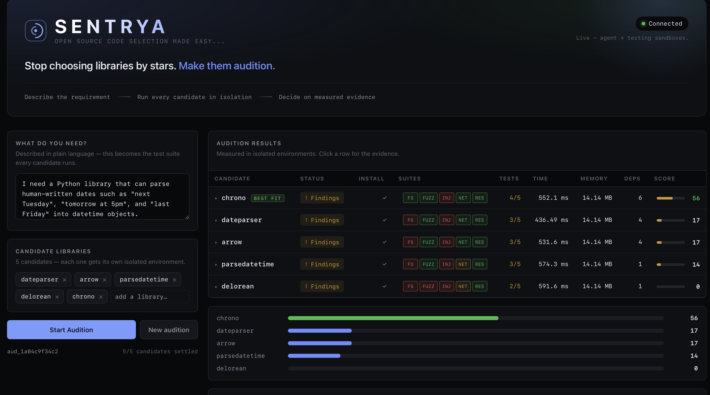

# Sentrya

**Stop choosing libraries by stars. Make them audition.**

Sentrya helps developers choose between competing open-source packages using
*measured evidence* instead of GitHub stars or README claims. You describe what you
need, name the candidates, and each one is installed and exercised in its own isolated
environment while five runtime suites watch what it actually does.



## The problem

GitHub gives you CodeQL, Dependabot and secret scanning — all of which read *source*.
None of them answer the question you actually have when you add a dependency:

> **What happens when this thing runs?**

Sentrya answers it by running each candidate and measuring the result.

## What it measures

Every candidate runs the same five-suite battery, in parallel, each in its own sandbox:

| Suite | What it checks |
| --- | --- |
| **Filesystem** | Writes outside the sandbox working directory, path traversal |
| **Fuzzing** | Behaviour under malformed, hostile and boundary input |
| **Injection** | SQL, command, path and template injection surfaces |
| **Network** | Outbound connections at import time and at call time |
| **Resources** | Peak memory, CPU and disk against configured limits |

Results stream into the scoreboard as each suite lands — you watch the battery fill in
per candidate rather than staring at a spinner. Click any row for the evidence behind
the verdict: per-suite findings, failed cases, timings and runtime behaviour.

The recommendation comes from the backend's deterministic score. **There is no LLM in
the frontend and no LLM deciding the winner** — the ranking is a function of what was
measured.

## Running it

```bash
./dev.sh
```

* **App** — <http://localhost:5173>
* **Agent API** — <http://127.0.0.1:8000> (OpenAPI docs at `/docs`)

First run creates `.venv`, installs `requirements.txt` and the app's npm dependencies,
then starts both halves together. Ctrl+C stops everything.

Requires Python 3.11+ and Node 18+. No API keys — the suites run in local sandboxes.

<details>
<summary>Running the halves separately</summary>

```bash
# agent + testing
python3 -m venv .venv && .venv/bin/pip install -r requirements.txt
PYTHONPATH=. .venv/bin/python -m uvicorn agent.server:app --port 8000

# app
cd app && npm install && npm run dev
```
</details>

The app auto-detects the agent: if `/api/health` answers it runs live, otherwise it
falls back to a built-in demo mode so the UI is never dead. Force either way with
`VITE_DEMO_MODE=true|false` in `app/.env`.

## Architecture

```text
app/  ──HTTP──▶  agent/  ──in-process──▶  testing/  ──▶  sandbox per suite
 React UI        orchestrator             5 suites       isolated, parallel
```

The three components are independent. The app knows five endpoints and nothing about
how an evaluation happens — swap the entire testing backend and the UI is unchanged.

| Method | Path | Purpose |
| --- | --- | --- |
| `GET` | `/api/health` | mode detection |
| `POST` | `/api/auditions` | start a run, returns an `Audition` |
| `GET` | `/api/auditions/{id}` | full state, including partial results |
| `GET` | `/api/auditions/{id}/status` | just the status |
| `DELETE` | `/api/auditions/{id}` | cancel |

The app polls `GET /api/auditions/{id}` while a run is in flight. The orchestrator
writes each suite into the store the moment it lands — that is what makes results
appear progressively instead of all at once.

`agent/models.py` and `app/src/types/audition.ts` are the same data model in two
languages. Change one, change the other.

### Layout

```text
├── app/        # React + TypeScript dashboard (Vite)
├── agent/      # FastAPI orchestrator — runs candidates, scores, recommends
├── testing/    # The five runtime suites + sandbox management
└── dev.sh      # Starts everything
```

## Status

Working end to end: five suites execute in parallel per candidate, results stream to
the dashboard, scores and the recommendation are computed from measured output.

Known scaffolding, ahead of production use:

* Candidates are exercised through a generated subject program rather than a real
  `pip install` of the package — the harness is real, the subject is not yet.
* `LocalSandbox` is process-level isolation; the Daytona adapter is stubbed and needs
  SDK wiring before untrusted code should be run.
* The store is in-memory and unbounded.

## Tech

Python · FastAPI · React · TypeScript · Vite · Daytona (planned)
